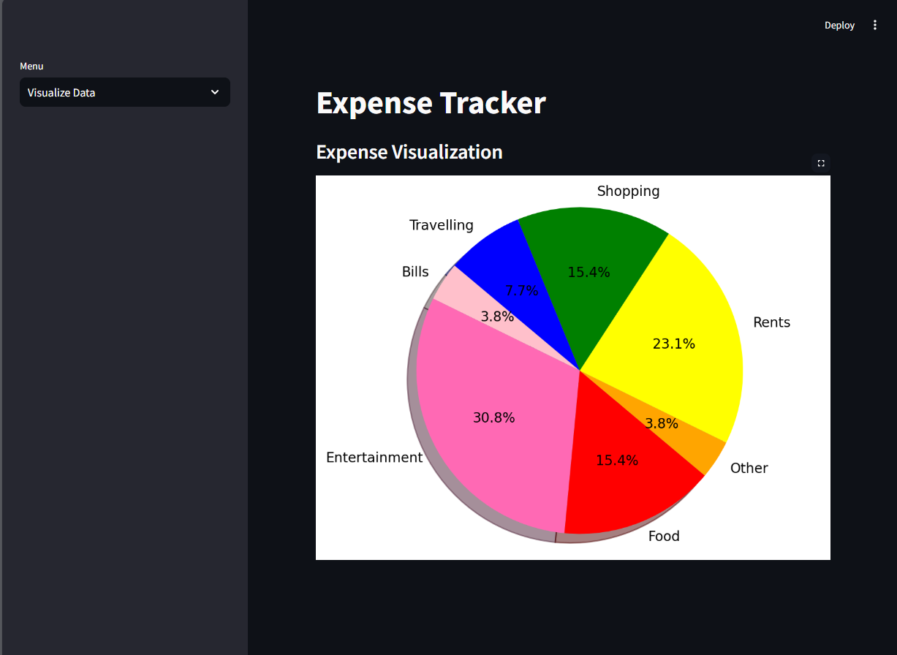

# Expense Tracker 💰📊

## Overview

The **Expense Tracker** is a Python-based application designed to help users manage and analyze their daily expenses. With features like adding, editing, and deleting expense records, and visualizing spending patterns, it’s a comprehensive tool for personal finance management.

## Features

- **Add Expenses :** Record detailed information about your expenses.
- **Edit Expenses :** Update existing expense records as needed.
- **Delete Expenses :** Remove outdated or incorrect expense records.
- **Data Visualization :** Gain insights into your spending habits with intuitive graphs and charts.
- **SQLite Database Integration :** All data is securely stored in a local SQLite database.
- **Web Application :** A user-friendly web interface built with Streamlit for seamless interaction.

## Images

#### Add Expense

#### Visualize Expenses

#### Edit Expense

